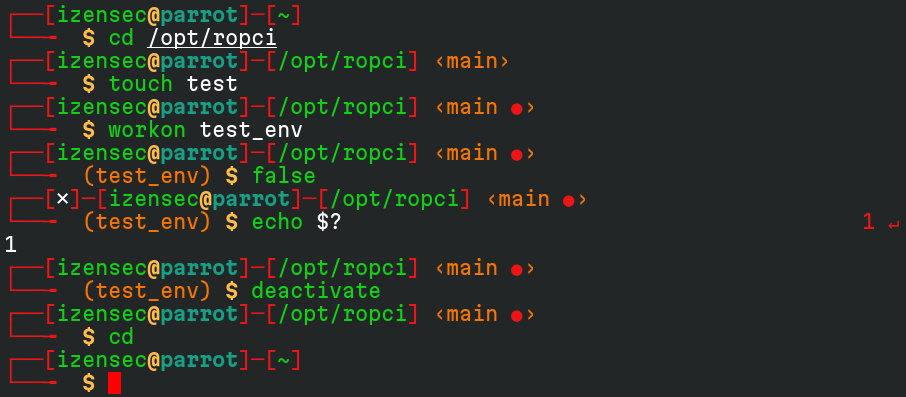
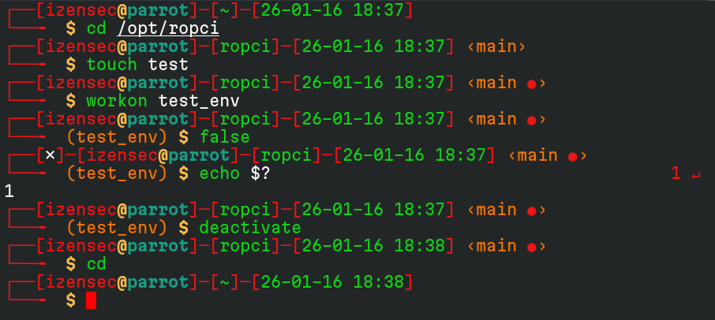

# Parrot Oh My Zsh Theme

An Oh my zsh **theme** based on **Parrot OS**'s default bash theme.

It comes with **two variants** that support git, python virtual environments and ruby version manager.

- **Original look**: `parrot.zsh-theme`, looks **exactly like Parrot's theme with one addition**, if a command fails, the status code is displayed at the right side of the prompt.



- **Customized look**: `parrot-plus-time.zsh-theme`, adds the date & time, displays the last directory not the full path, and prints the username in red. 



## Prerequisites

- [Zsh](https://www.zsh.org) should be installed (v5.0.8 and newer). If not pre-installed (run `zsh --version` to confirm), 
  check the following wiki instructions:
  [Installing ZSH](https://github.com/ohmyzsh/ohmyzsh/wiki/Installing-ZSH)
- [Oh My Zsh](https://ohmyz.sh/), check the install instructions: [Basic Installation](https://github.com/ohmyzsh/ohmyzsh/#basic-installation)


## Install

- Download `parrot.zsh-theme` or `parrot-plus-time.zsh-theme` to your Oh My Zsh custom theme directory: `~/.oh-my-zsh/custom/themes`. You can create one if it doesn't exist.
- Change your theme in the `~/.zshrc` file by changing the variable `ZSH_THEME` to the name of the file you downloaded without extension (i.e. `parrot` or `parrot-plus-time`).
- Run `exec zsh` to update your shell with the new configuration.

**Optional (recommended):** The following plugins are **not required**, but enabling them helps ensure the prompt renders correctly. Without these plugins, some elements (such as the Python virtual environment) may appear on the first line and break the prompt layout.
Modify the `~/.zshrc` file by adding the following plugins:

```bash
plugins=(
        git
        virtualenv
        rvm
    )
```